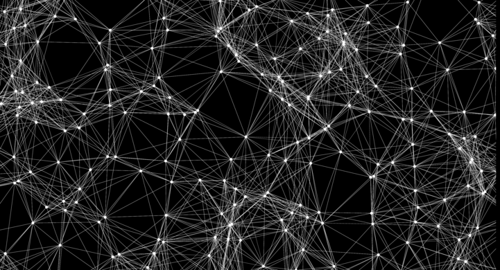

# Background

Deep learning is a type of artifitial intelligence model that uses linear algebra and multivariable calculus to learn the relationship between an set of inputs and a set of outputs. A deep learning model is a neural network that involves more than 1 hidden layer.

## Prerequisites:
- Transformations, mappings, vector and matrix multiplication and other operations from linear algebra
- Partial derivatives and their implications from multivariable calculus

# Forward Propagation
Let $\vec{x}$ be the input vector, $\vec{h^\ell}$ be 1 of $\ell$ hidden layer vectors, and $\vec{y}$ be the ouput vector.

$$
\vec{x} =
\begin{bmatrix}
	x_1\\
	x_2\\
	\vdots\\
	x_m
\end{bmatrix} \in \mathbb{R^m}
,
\vec{h^1} =
\begin{bmatrix}
	h_1\\
	h_2\\
	\vdots\\
	h_k
\end{bmatrix} \in \mathbb{R^k}
,
\vec{h^{\ell}} =
\begin{bmatrix}
	h_1\\
	h_2\\
	\vdots\\
	h_k
\end{bmatrix} \in \mathbb{R^k}
,
\vec{y} =
\begin{bmatrix}
	y_1\\
	y_2\\
	\vdots\\
	y_n
\end{bmatrix} \in \mathbb{R^n}
$$

Let $T_1: \mathbb{R^m}	\rightarrow \mathbb{R^k}$ be a linear mapping. $T_1$ maps the input layer vector $\vec{x} \in \mathbb{R^m}$ to the hidden layer vector  $\vec{h^\ell} \in \mathbb{R^k}$.

Each transformation from 1 layer to the next is represented by a matrix of wieghts and a vector of biases and an (optional) activation function.

$$
\begin{gather}
W_1 =
	\begin{bmatrix}
	w_{1,1} & w_{1,2} & \ldots & w_{1,m}\\
	w_{2,1} & w_{2,2} & \ldots & w_{2,m}\\
	\vdots & \vdots & \ddots & \vdots\\
	w_{k,1} & w_{k,2} & \ldots & w_{k,m}\\
	\end{bmatrix}
\end{gather}
$$

$$
T_1(\vec{x}) = \sigma(W_1\vec{x}) = \vec{h}
$$

And let $T_2: \mathbb{R^h}	\rightarrow \mathbb{R^n}$ be a linear mapping. $T_2$ maps the hidden layer vector $\vec{h} \in \mathbb{R^h}$ to the output layer vector  $\vec{y} \in \mathbb{R^n}$.

$$
\begin{gather}
W_2 = \begin{bmatrix}
	w_{1,1} & w_{1,2} & \ldots & w_{1,h}\\
	w_{2,1} & w_{2,2} & \ldots & w_{2,h}\\
	\vdots & \vdots & \ddots & \vdots\\
	w_{n,1} & w_{n,2} & \ldots & w_{n,h}\\
	\end{bmatrix}

\newline
\newline

T_2(\vec{h}) = W_2\vec{h} = \vec{y}

\end{gather}
$$

These weight matrices are initally composed of randomly generated scalars, but during backpropagation the values of the true weights are esitmated. The hypothesis of the neural network is that the true weight matrices for the given transformation explains the true relationship between the input and output vectors.

## Summary
To summarise the forward propogations process...

$$
T_1(\vec{x}) = \sigma(W_1\vec{x}) = \vec{h}

\newline
\newline

T_2(\vec{h}) = W_2\vec{h} = \vec{y}
$$

Are the linear mappings represented by weight matrices that map the input vector to the hidden vector to the output vector. Now we will study the process of optimizing the weights to minimize the loss function $\mathcal{L}$.

# Back Propgation

If you haven't already been mezmerised, get ready for the real magic show: back progagation. It is the process of adjusting the weights and biases in the direction of the local minimun of the loss function with respect to each individual weight as computed by the partial derivative of the loss function with respect to the given weight.

> **_NOTE:_** Remember, the derivative of a function $f(x)$ at a certian point equals the slope of that function at the given point. And the partial derivative of a multivariable function $f(x,y,z)$ at a given point with respective to a given variable equals the derivative of that function with respect to the given variable. In this article we will be using `directional derivates`. They are partial derivates for vector valued functions. They represent the instantaneous rate of change along the axis of the given variable with which the partial derivative is taken.

The weight matrices $W_1$ and $W_2$ are composed of initally random scalars. With each back propagation, the partial derivative of Loss fuction with respect to each weight is computed.

There are a variety of `loss functions` to choose from, each with different use cases. Here we will be using the `MSE` (mean squared error) function as follows.

$$
\mathcal{L}(y, \hat{y}) = \Sigma_{i=1}^{m}(y_i - \hat{y_i})^2
$$

Where $y$ denotes the true ouputs and $\hat{y}$ denotes the estimated outputs from the last forward propagation.

In order to compute the partial derivate of $\mathcal{L}(y, \hat{y})$ with respect to a given weight, we must formulate $\mathcal{L}$ in terms of the weights. First we will rewrite $\hat{y_i}$ in terms of a given weight, $w_{i,j}$.

$$
\hat{y_i} = W_2\sigma(W_1\vec{x})
$$

$$
\Rightarrow
\mathcal{L}(y,\hat{y}) = \Sigma_{i=1}^{m}(y_i - \hat{y_i})^2
$$

$$
\newline
\frac{\partial \mathcal{L}}{\partial w_{i,j}} = \frac{\partial s
}{\partial t}
$$

